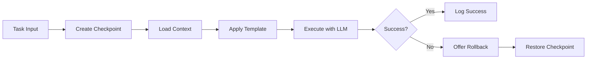

# Giant Agent Mode - Autonomous AI Development

Transform your development workflow with autonomous AI agents that can complete complex coding tasks while maintaining safety through checkpoints and boundaries.

## Table of Contents

1. [Overview](#overview)
2. [Core Concepts](#core-concepts)
3. [Getting Started](#getting-started)
4. [Command Reference](#command-reference)
5. [Usage Examples](#usage-examples)
6. [Prompt Templates](#prompt-templates)
7. [Provider Configuration](#provider-configuration)
8. [Safety & Best Practices](#safety--best-practices)
9. [Advanced Features](#advanced-features)
10. [Troubleshooting](#troubleshooting)

## Overview

Giant Agent Mode brings Cursor IDE-like autonomous coding capabilities to any LLM provider. It enables AI to work independently on complex tasks while maintaining safety through automatic checkpoints and clear boundaries.

### Key Features

- **🤖 Autonomous Execution** - AI completes entire features or refactors independently
- **💾 Checkpoint System** - Automatic snapshots before changes, instant rollback
- **🔌 Multi-Provider** - Works with Claude Code, OpenAI (coming), and custom CLIs
- **📋 Batch Processing** - Execute multiple tasks in sequence
- **🛡️ Safety First** - No git commits/pushes, respects project boundaries
- **🎯 Template System** - Specialized prompts for different task types
- **📊 Session Logging** - Track all agent activities for review

## Core Concepts

### Agent Workflow



### Checkpoint System

Checkpoints are automatic snapshots of your project state before agent tasks:

- **Git Projects**: Uses `git stash` for efficient storage
- **Non-Git Projects**: Creates file backups in `.ai-setup/checkpoints/`
- **Metadata Tracking**: Timestamps, descriptions, modified files
- **Auto-Cleanup**: Keeps latest 20 checkpoints by default

### Safety Boundaries

The agent operates within strict boundaries:

- ❌ Cannot commit or push to git
- ❌ Cannot modify files outside project directory
- ❌ Cannot delete critical system files
- ✅ Can create, edit, and delete project files
- ✅ Can run terminal commands (with output)
- ✅ Can search and analyze code

## Getting Started

### 1. Initial Setup

```bash
# Run the global setup if you haven't already
./giant-ai-dev/scripts/ai-setup

# This creates the ai-agent command
which ai-agent  # Should show: ~/.local/bin/ai-agent
```

### 2. Project Configuration

```bash
# In your project directory
ai-agent config --init

# This creates .ai-setup/agent.yml with defaults
```

### 3. First Agent Task

```bash
# Simple task
ai-agent task "Add input validation to the login form"

# With auto-accept (no confirmation prompts)
ai-agent task "Add comprehensive logging to all API endpoints" --auto-accept
```

## Command Reference

### `ai-agent task`

Execute a single autonomous task.

```bash
ai-agent task "description" [options]

Options:
  --auto-accept        Auto-accept all changes (no prompts)
  --no-checkpoint      Skip checkpoint creation
  --template NAME      Use specific prompt template (default/feature/refactor/debug)
  --provider NAME      Override default provider
  --continue           Continue previous session

Examples:
  ai-agent task "Add dark mode support"
  ai-agent task "Refactor auth module" --template refactor --auto-accept
  ai-agent task "Fix the bug in payment processing" --template debug
```

### `ai-agent batch`

Execute multiple tasks from a file.

```bash
ai-agent batch tasks.txt [options]

Options:
  --auto-accept          Auto-accept all changes
  --continue-on-failure  Don't stop if a task fails
  --no-checkpoint        Skip initial checkpoint

Example tasks.txt:
# Authentication improvements
Refactor the login function to use async/await
Add rate limiting to login attempts
Implement forgot password functionality

# API enhancements  
Add pagination to all list endpoints
Implement consistent error response format
Add request ID tracking for debugging
```

### `ai-agent interactive`

Start interactive mode with manual control.

```bash
ai-agent interactive

Commands in interactive mode:
  task <description>    Execute a task
  checkpoint [desc]     Create manual checkpoint
  restore <id>         Restore to checkpoint
  list                 Show recent checkpoints
  exit                 Exit interactive mode

Example session:
agent> task Add user profile API endpoint
agent> checkpoint "After API creation"
agent> task Add tests for profile endpoint
agent> list
agent> restore 20240106_143022  # If needed
```

### `ai-agent checkpoint`

Manual checkpoint management.

```bash
# Create checkpoint
ai-agent checkpoint "Before major refactor"

# List checkpoints
ai-agent list [--limit 20]

# Restore checkpoint
ai-agent restore 20240106_143022
```

### `ai-agent config`

Manage agent configuration.

```bash
# Initialize config
ai-agent config --init

# Show current config
ai-agent config
```

## Usage Examples

### Example 1: Feature Development

```bash
# Create a complete feature with tests
ai-agent task "Implement user notifications system with email and in-app alerts" \
  --template feature \
  --auto-accept
```

The agent will:
1. Create checkpoint
2. Analyze requirements
3. Create necessary files (models, controllers, views)
4. Implement business logic
5. Add error handling
6. Create tests
7. Update documentation

### Example 2: Code Refactoring

```bash
# Refactor for better architecture
ai-agent task "Refactor the payment module to use strategy pattern" \
  --template refactor
```

The agent will:
1. Analyze current implementation
2. Plan refactoring approach
3. Create new structure
4. Migrate existing code
5. Ensure tests still pass
6. Update imports/exports

### Example 3: Batch Operations

Create `modernize.txt`:
```
Convert all class components to functional components with hooks
Replace Redux with Context API for simple state
Add TypeScript interfaces to all API responses
Implement proper error boundaries
Add loading states to all async operations
```

Execute:
```bash
ai-agent batch modernize.txt --continue-on-failure
```

### Example 4: Interactive Debugging

```bash
ai-agent interactive

agent> task Debug why user sessions are expiring early
🤖 Executing agent task: Debug why user sessions are expiring early
   Provider: ClaudeCodeProvider
   Auto-accept: False
[Agent investigates code, finds issue, proposes fix]

agent> checkpoint "Found session timeout issue"
✅ Created checkpoint: 20240106_152234

agent> task Apply the session timeout fix
[Agent applies the fix]

agent> task Add tests to prevent session timeout regression
[Agent adds comprehensive tests]
```

### Example 5: Complex Migration

```bash
# First, create a checkpoint
ai-agent checkpoint "Before database migration"

# Execute migration tasks
ai-agent task "Migrate from MongoDB to PostgreSQL maintaining all data relationships" \
  --auto-accept

# If something goes wrong
ai-agent list
ai-agent restore 20240106_160000
```

## Prompt Templates

### Default Template

Used for general tasks. Focuses on:
- Breaking down tasks into steps
- Following project conventions
- Testing changes
- Clear summaries

### Feature Template

Optimized for new feature development:
- Requirements analysis
- Architecture design
- Implementation steps
- Integration testing
- Documentation updates

### Refactor Template

Specialized for code improvements:
- Current state analysis
- Incremental changes
- Maintaining functionality
- Performance considerations
- Pattern application

### Debug Template

For investigating and fixing issues:
- Problem identification
- Root cause analysis
- Solution implementation
- Regression prevention
- Testing edge cases

### Custom Templates

Create your own in `agent/prompts/`:

```markdown
# agent/prompts/security.md
# Agent Mode - Security Audit

## Task
{task}

## Security Focus Areas
- Input validation
- Authentication checks
- Authorization boundaries
- Data sanitization
- Error handling
- Logging sensitive data

## Process
1. Identify security vulnerabilities
2. Prioritize by severity
3. Implement fixes
4. Add security tests
5. Update security documentation
```

## Provider Configuration

### Claude Code (Default)

```yaml
# .ai-setup/agent.yml
provider: claude-code

claude_code:
  auto_accept_enabled: true
  model: claude-3-opus-20240229  # Optional
  temperature: 0  # Optional
```

Features:
- ✅ Auto-accept mode
- ✅ File operations
- ✅ Terminal commands
- ✅ Search capabilities

### OpenAI (Coming Soon)

```yaml
provider: openai

openai:
  auto_accept_enabled: false  # Not yet supported
  model: gpt-4-turbo
  api_key_env: OPENAI_API_KEY
```

### Custom Provider

Create your own provider by extending `BaseLLMProvider`:

```python
# agent/providers/custom.py
from .base import BaseLLMProvider

class CustomProvider(BaseLLMProvider):
    def execute_agent_task(self, task, context):
        # Your implementation
        pass
    
    def supports_auto_accept(self):
        return True
    
    def get_capabilities(self):
        return ["file_edit", "file_create", "search"]

# Register it
LLMProviderFactory.register_provider("custom", CustomProvider)
```

## Safety & Best Practices

### 1. Checkpoint Strategy

**Always checkpoint before:**
- Major refactors
- Database migrations
- File structure changes
- Dependency updates

**Manual checkpoints:**
```bash
ai-agent checkpoint "Before removing legacy code"
ai-agent task "Remove all deprecated API endpoints"
```

### 2. Task Granularity

**Good task descriptions:**
- ✅ "Add input validation to user registration form"
- ✅ "Refactor database queries to use prepared statements"
- ✅ "Add comprehensive error handling to payment module"

**Poor task descriptions:**
- ❌ "Fix the app" (too vague)
- ❌ "Rewrite everything" (too broad)
- ❌ "Make it faster" (not specific)

### 3. Review Practices

**Without auto-accept (default):**
- Agent shows planned changes
- You review and approve/reject
- Changes are applied incrementally

**With auto-accept:**
- Use for well-defined tasks
- Always create checkpoint first
- Review changes after completion

### 4. Batch Task Guidelines

**Organize related tasks:**
```
# Good: Related tasks that build on each other
Add user authentication endpoints
Add JWT token generation
Add token refresh mechanism
Add authentication middleware
Add authentication tests

# Bad: Unrelated tasks that might conflict
Refactor authentication
Update UI colors
Change database schema
Add new feature
Fix random bugs
```

### 5. Recovery Procedures

**If something goes wrong:**

```bash
# 1. Don't panic - check recent checkpoints
ai-agent list

# 2. Find the right checkpoint
ai-agent list --limit 30

# 3. Restore to safe state
ai-agent restore 20240106_143022

# 4. Try again with better task description
ai-agent task "Add error handling ONLY to payment.js file"
```

## Advanced Features

### Session Continuity

Continue working across multiple tasks:

```bash
# First task establishes context
ai-agent task "Create new user management module"

# Continue in same context
ai-agent task "Add role-based permissions to user module" --continue
ai-agent task "Add admin interface for user management" --continue
```

### Dynamic Provider Switching

```bash
# Try with Claude first
ai-agent task "Complex refactoring task" --provider claude-code

# If needed, try different provider
ai-agent task "Complex refactoring task" --provider openai
```

### Checkpoint Analysis

```python
# View checkpoint details
import json
from pathlib import Path

checkpoint_file = Path(".ai-setup/checkpoints/20240106_143022.json")
with open(checkpoint_file) as f:
    metadata = json.load(f)
    
print(f"Files modified: {metadata['modified_files']}")
print(f"Description: {metadata['description']}")
print(f"Git status: {metadata['git_status']}")
```

### Custom Workflows

Create project-specific workflows:

```bash
#!/bin/bash
# scripts/ai-modernize.sh

# Comprehensive modernization workflow
echo "Starting modernization workflow..."

# Phase 1: Analysis
ai-agent checkpoint "Before modernization"
ai-agent task "Analyze codebase and create modernization plan" \
  --template feature > modernization-plan.md

# Phase 2: Type Safety
ai-agent task "Add TypeScript to all JavaScript files" \
  --auto-accept

# Phase 3: Component Updates  
ai-agent task "Convert class components to hooks" \
  --template refactor \
  --auto-accept

# Phase 4: Testing
ai-agent task "Add missing tests for modernized code" \
  --auto-accept

echo "Modernization complete! Review changes and run tests."
```

### Integration with CI/CD

```yaml
# .github/workflows/ai-assist.yml
name: AI-Assisted Code Review

on:
  pull_request:
    types: [opened]

jobs:
  ai-review:
    runs-on: ubuntu-latest
    steps:
      - uses: actions/checkout@v3
      
      - name: Setup AI Agent
        run: |
          ./giant-ai-dev/scripts/ai-setup
          
      - name: Run AI Analysis
        run: |
          ai-agent task "Review code changes and suggest improvements" \
            --no-checkpoint \
            --template review > ai-review.md
            
      - name: Post Review
        uses: actions/github-script@v6
        with:
          script: |
            const review = fs.readFileSync('ai-review.md', 'utf8');
            github.rest.pulls.createReview({
              owner: context.repo.owner,
              repo: context.repo.repo,
              pull_number: context.issue.number,
              body: review
            });
```

## Troubleshooting

### Common Issues

**"Provider not found" error:**
```bash
# Check available providers
python3 -c "from agent.providers.base import LLMProviderFactory; print(LLMProviderFactory.list_providers())"

# Verify provider in config
cat .ai-setup/agent.yml
```

**"No checkpoint found" error:**
```bash
# List all checkpoints with full paths
ls -la .ai-setup/checkpoints/

# Check checkpoint metadata
cat .ai-setup/checkpoints/*.json | jq .
```

**Auto-accept not working:**
```bash
# Verify provider supports it
ai-agent config | grep auto_accept

# Check Claude Code is installed
which claude

# Test with explicit flag
ai-agent task "Simple task" --auto-accept --provider claude-code
```

**Git stash conflicts:**
```bash
# Check git stash list
git stash list

# Clear old AI agent stashes
git stash list | grep "AI Agent Checkpoint" | cut -d: -f1 | xargs -n1 git stash drop

# Use file-based checkpoints instead
# Add to .ai-setup/agent.yml:
checkpoint_strategy: files  # Instead of git
```

### Debug Mode

Enable detailed logging:

```bash
# Set debug environment variable
export AI_AGENT_DEBUG=1

# Run with verbose output
ai-agent task "Debug task" --auto-accept

# Check session logs
tail -f .ai-setup/agent_sessions.jsonl | jq .
```

### Performance Tips

1. **Large Codebases:**
   - Create focused checkpoints (not full project)
   - Use specific task descriptions
   - Break large tasks into smaller ones

2. **Slow Execution:**
   - Check provider response times
   - Reduce context size in templates
   - Use --no-checkpoint for read-only tasks

3. **Memory Issues:**
   - Limit checkpoint retention
   - Clean old checkpoints regularly
   - Use git-based checkpoints when possible

## Best Practices Summary

1. **Start Small**: Begin with simple, well-defined tasks
2. **Use Templates**: Choose the right template for your task type
3. **Checkpoint Often**: Create manual checkpoints for important states
4. **Review First**: Use auto-accept only after you trust the agent
5. **Batch Wisely**: Group related tasks, separate unrelated ones
6. **Monitor Progress**: Check session logs and checkpoint history
7. **Iterate**: Refine task descriptions based on results

## Future Roadmap

- 🔄 **More Providers**: OpenAI, Anthropic API, Gemini, Local LLMs
- 🧪 **Test Integration**: Automatic test execution after changes
- 📊 **Metrics Tracking**: Success rates, execution times, token usage
- 🔍 **Smart Rollback**: Automatic rollback on test failures
- 🤝 **Collaborative Mode**: Multiple agents working together
- 🎯 **Goal-Oriented**: High-level goals broken into tasks automatically

---

Giant Agent Mode empowers you to work at a higher level of abstraction, focusing on what you want to achieve rather than how to implement it. With safety checkpoints and multiple provider support, you get the benefits of autonomous AI development without vendor lock-in or risk.

Happy autonomous coding! 🚀